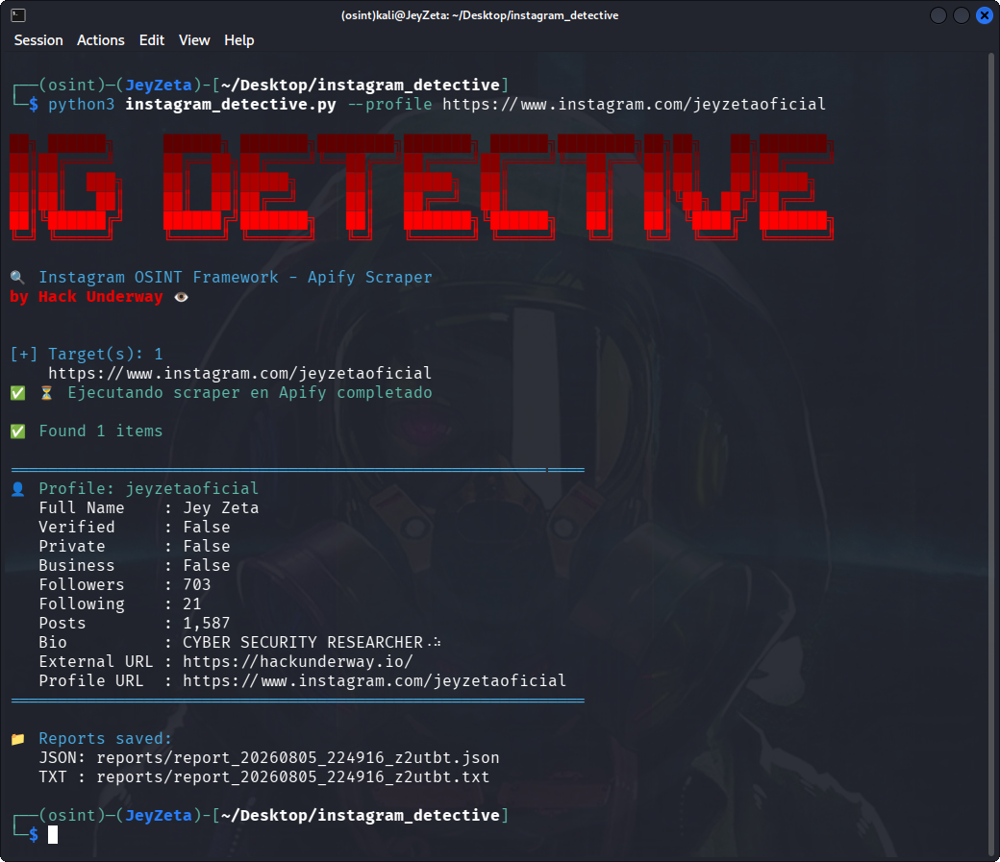
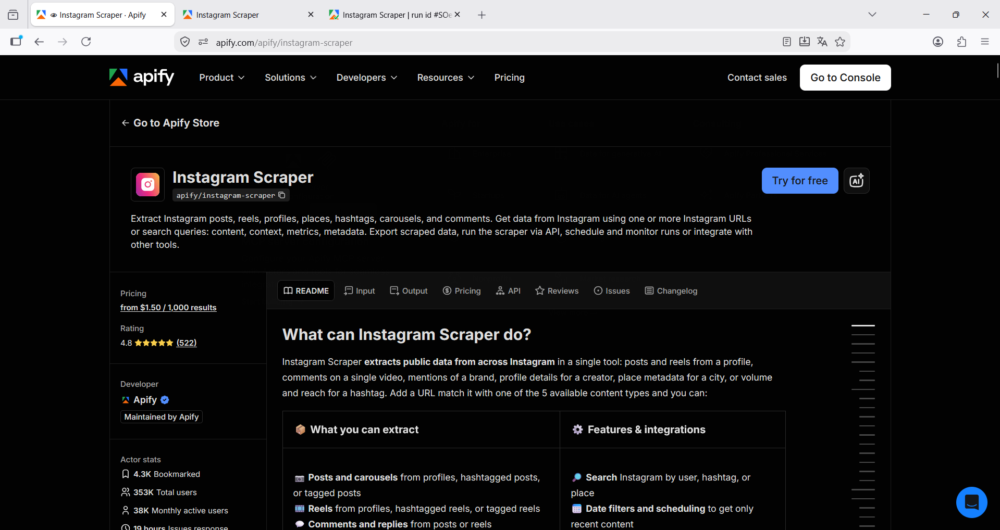
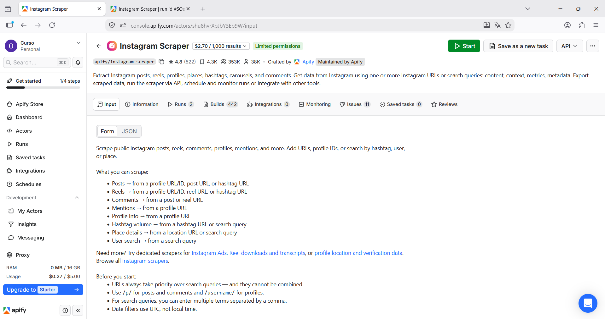
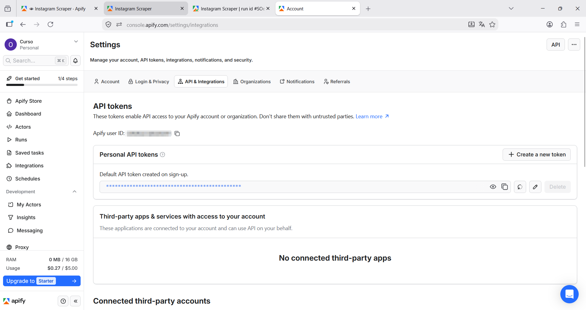
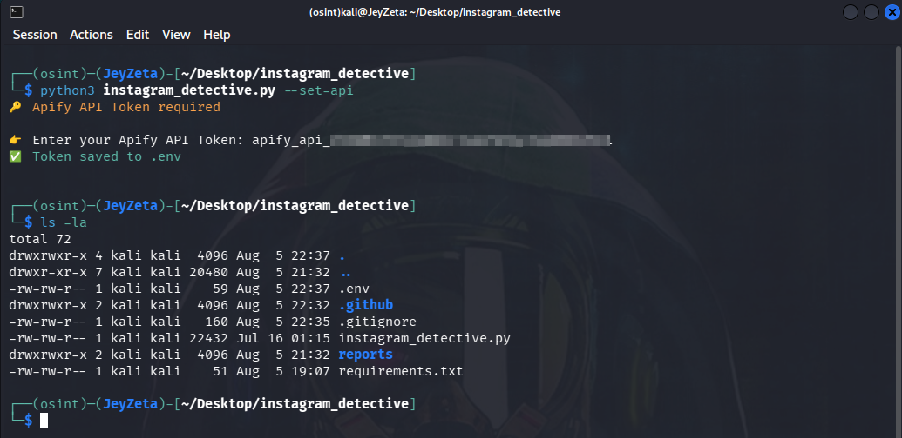
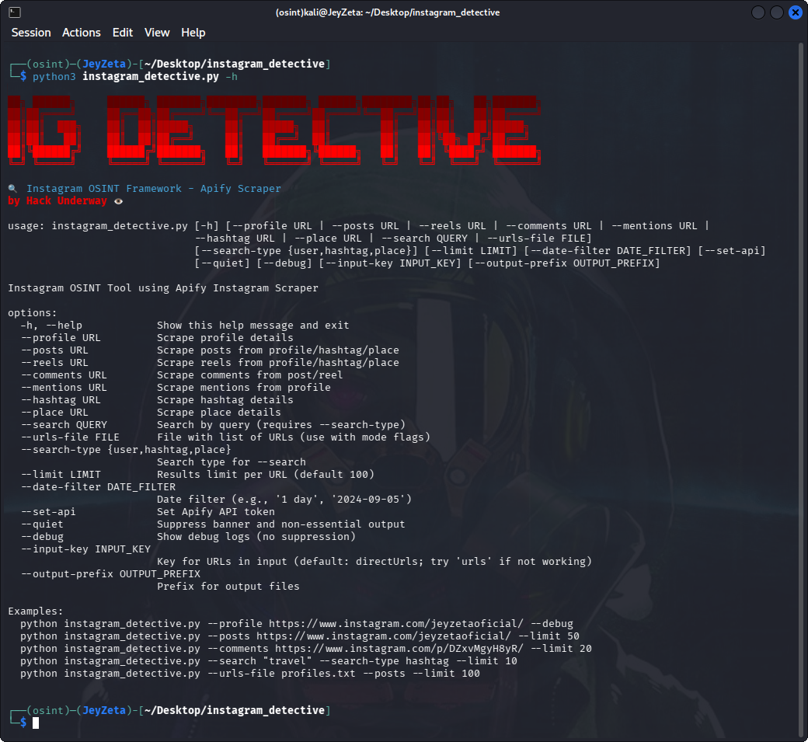

<h1 align="center">🕵️‍♂️ Instagram Detective</h1>

<p align="center">
  <strong>Instagram OSINT Framework</strong> to extract public profiles, posts, reels, comments, mentions, hashtags, and places from Instagram using the Apify API.
</p>

<p align="center">
  
</p>

<p align="center">
  
  
  
</p>

---

## 🚀 Features

- 🔍 **Profile Reconnaissance:** Extract full Instagram profile data (bio, followers, following, posts count, etc.)
- 📷 **Media Scraping:** Scrape posts, reels, comments, mentions, hashtag details, and place details.
- ⚡ **Fast API-Based Checking:** Powered by Apify's Instagram Scraper (`apify/instagram-scraper`).
- 📄 **JSON and TXT Report Generation:** All results are saved locally with timestamps.
- 🎨 **Colored CLI Interface:** Clean and professional terminal output.
- 🔐 **Secure API Key Handling:** Credentials stored in `.env`.
- 📂 **Batch Processing:** Scan multiple URLs via TXT file.
- 🕒 **Animated Progress:** Live progress bar during scraping (with `alive-progress`).
- 💡 **Automatic API Setup:** Interactive onboarding via `--set-api`.

## 📌 Prerequisites

- Python 3.8+
- Dependencies: `apify-client`, `python-dotenv`, `colorama`, `alive-progress`

## 🔑 API Key (Apify)

Instagram Detective uses the following API:

| NAME | KEY |
| ---- | --- |
| [Instagram Scraper](https://apify.com/apify/instagram-scraper) | 🔑 (Required) |

### Steps:
1. Go to [Apify](https://apify.com) and create a free account.
2. Get your **API Token** from your Apify account settings.
3. Copy your API Token.

<p align="center">
  
</p>

<p align="center">
  
</p>

<p align="center">
  
</p>

## ⚙️ Configuration

You can set your API key at any time with:

```bash
python3 instagram_detective.py --set-api
```

Your key will be automatically saved in:

.env

<p align="center">
  
</p>

---

# 💻 Usage

### 🔹 Single target (profile)
```bash
python3 instagram_detective.py --profile https://www.instagram.com/jeyzetaoficial
```

### 🔹 Scrape posts from a profile
```bash
python3 instagram_detective.py --posts https://www.instagram.com/jeyzetaoficial --limit 50
```

### Scrape reels
```bash
python3 instagram_detective.py --reels https://www.instagram.com/jeyzetaoficial --limit 20
```

### Scrape comments from a post
```bash
python3 instagram_detective.py --comments https://www.instagram.com/p/DbfyigZltyo/ --limit 20
```

### Scrape mentions
```bash
python3 instagram_detective.py --mentions https://www.instagram.com/jeyzetaoficial
```

### Get hashtag details
```bash
python3 instagram_detective.py --hashtag https://www.instagram.com/explore/tags/travel/
```

### Get place details
```bash
python3 instagram_detective.py --place https://www.instagram.com/explore/locations/7538318/copenhagen/
```

### Search by query
```bash
python3 instagram_detective.py --search "travel" --search-type hashtag --limit 10
```

### Batch processing from file
```bash
python3 instagram_detective.py --urls-file urls.txt --profile
```
`urls.txt should contain one Instagram URL per line.`

### Show help
```bash
python3 instagram_detective.py -h
```

<p align="center">
  
</p>

---

# 📁 Reports

All results are saved in the `/reports/` directory.

Example file:
`report_20260716_005435_bz8cve.json`
`report_20260716_005435_bz8cve.txt`

> [!TIP]
> **Tip:** Check the generated JSON report for advanced profile metadata not displayed in the terminal – for example, the full `statistics` object with account type, HD profile picture URLs, and more. The TXT report also contains the raw JSON dump for easy reading.

---

# 📦 Installation

```bash
git clone https://github.com/HackUnderway/instagram_detective.git
```
```bash
cd instagram_detective
```
```bash
pip install -r requirements.txt
```

> [!WARNING]
> ## Disclaimer
> This tool is intended for **educational and OSINT research purposes only**.
> - Do not use for illegal activities.
> - The developer is not responsible for any misuse or damage caused by this tool.

---

# 🧠 Notes

The scraper extracts publicly available data from Instagram. For private accounts, it still retrieves basic profile metadata (username, bio, follower/following counts, profile picture, etc.) since this information is publicly visible. However, posts, reels, and comments from private accounts are not accessible.

Rate limits and usage costs apply. Apify charges $2.70 per 1,000 results on the Free plan. The free tier includes a limited number of credits; check your Apify balance before heavy usage.

A **MISS** or empty result may indicate:

- The URL is invalid or malformed.
- The account does not exist.
- Your Apify credits are exhausted.
- The actor expects a different input key (try `--input-key urls` if the default `directUrls` fails).

The script defaults to `directUrls` as the input key. If you encounter issues, switch to `urls` with:

```bash
python3 instagram_detective.py --profile <URL> --input-key urls
```

The JSON report contains all available metadata, including fields not displayed in the terminal (e.g., statistics object, full profile picture URLs, account type, etc.). Always check the generated JSON for complete data.

> **The project is open to collaborators and partners.**

# 🧪 Supported Systems
|Distribution | Verified version | 	Supported | 	Status |
|--------------|--------------------|------|-------|
|Kali Linux| 2026.2| ✅| Working   |
|ParrotOS| 7.3| ✅ | Working   |
|Windows| 11 | ✅ | Working   |
|BackBox| 9 | ✅ | Working   |
|Arch Linux| 2026.08.01 | ✅ | Working   |

# Support
For questions, bug reports, or suggestions, please contact: info@hackunderway.com

# License
- [x] Instagram Detective is licensed.
- [x] See the [LICENSE](https://github.com/HackUnderway/instagram_detective#MIT-1-ov-file) file for more information.

# 👨‍💻 Author

* [Victor Bancayan](https://www.offsec.com/bug-bounty-program/) - (**CEO at [Hack Underway](https://hackunderway.io/)**) 

## 🔗 Links
[](https://www.patreon.com/c/HackUnderway)
[](https://hackunderway.com)
[](https://www.facebook.com/HackUnderway)
[](https://www.youtube.com/@JeyZetaOficial)
[](https://x.com/JeyZetaOficial)
[](https://instagram.com/hackunderway)
[](https://tryhackme.com/p/JeyZeta)
[](https://ko-fi.com/hackunderway)
[](https://profile.hackthebox.com/profile/019d59e8-fcc1-72e9-9aad-ff79f46d261d)

### 💰 Bitcoin Donations
Support the project with Bitcoin:

### Address:
```bash
bc1qjd5pu8kmdqljun3qyw5e9mj4kdef9n8sutj7j4
```

<p align="center">  </p>
Thank you for your support! 🙏

## ☕️ Support the project

If you like this tool, consider buying me a coffee:

[](https://www.buymeacoffee.com/hackunderway)

## 🌞 Subscriptions

###### Subscribe to: [Jey Zeta](https://www.facebook.com/JeyZetaOficial/subscribe/)

[](https://www.kali.org/)

from  Peru, made in  with  by: Victor Bancayan

© 2026
